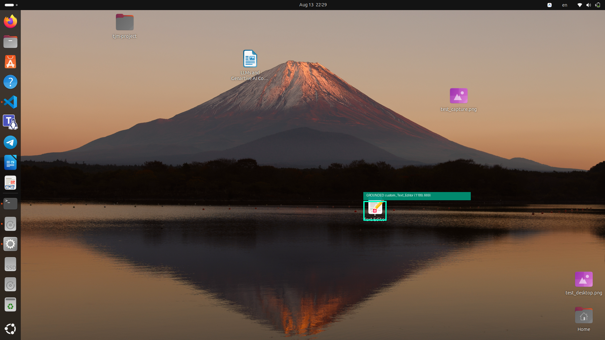
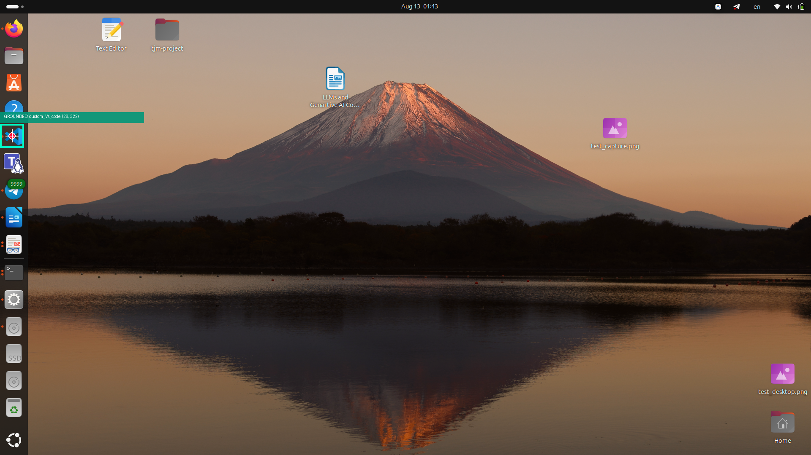
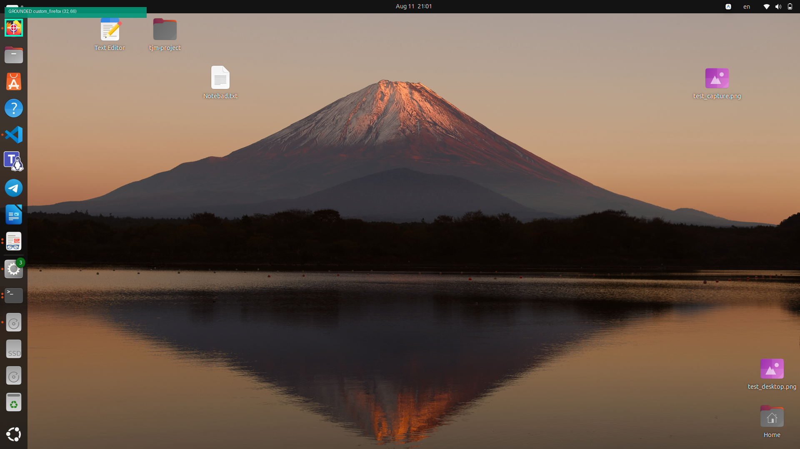
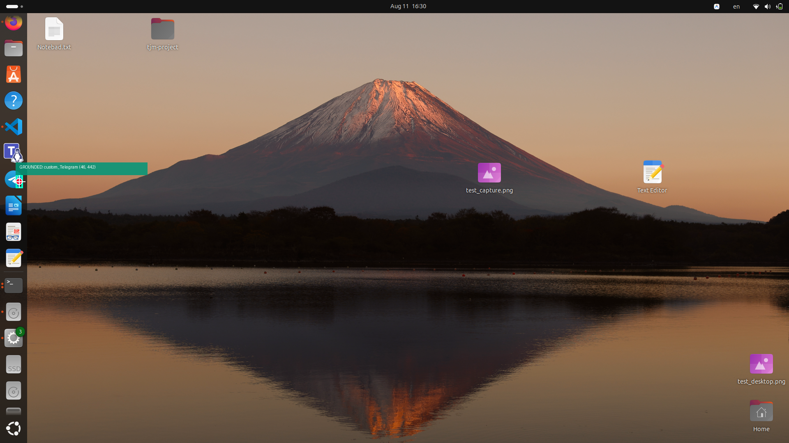

# Vision-Based Desktop Automation with Dynamic Icon Grounding (ScreenSeekeR)


This repository implements a zero-shot, vision-based desktop automation system in Python that dynamically locates and interacts with desktop application icons—specifically **Notepad / Text Editor**—on a 1920x1080 resolution display across Linux (Ubuntu Wayland/X11) and Windows 10/11 environments.

Our visual grounding engine implements the **ScreenSeekeR** framework from the research paper [*ScreenSpot-Pro: GUI Grounding for Professional High-Resolution Computer Use* (arXiv:2504.07981)](https://arxiv.org/abs/2504.07981).

---

## 📸 Grounding Deliverables & Examples

ScreenSeekeR performs recursive coarse-to-fine visual search and sub-pixel grounding. Below are actual grounded screenshot deliverables generated by the system:

### 1. Notepad / Text Editor Grounding


### 2. VS Code & IDE Launcher Grounding


### 3. Web Browser (Firefox / Chrome) Grounding


### 4. Application Dock & System Icons Grounding


---

## 🔬 Core Architecture (ScreenSeekeR Paper Integration)

High-resolution 1080p desktop screenshots often cause MLLMs to lose small 32x32 to 48x48 pixel desktop icons during standard token downsampling. ScreenSeekeR eliminates this bottleneck through a 5-stage pipeline:

```
┌──────────────────────────────────────────────────────────────────────────────────┐
│                             Automation Orchestrator                              │
│                                   (main.py)                                      │
└──────┬────────────────────────────────────────────────────────────────────┬──────┘
       │                                                                    │
       ▼                                                                    ▼
┌───────────────┐                                                  ┌────────────────┐
│ API Integrator│                                                  │ Screen Capture │
│ (JSONPlaceholder)                                                │ (Portal / MSS) │
└──────┬────────┘                                                  └────────┬───────┘
       │ Fetch 10 posts                                    1080p Screenshot │
       ▼                                                                    ▼
┌──────────────────────────────────────────────────────────────────────────────────┐
│                            ScreenSeekeR Search Engine                            │
│                        (src/screen_seeker.py & planner.py)                       │
│                                                                                  │
│ 1. Position Inference (Planner via MLLM)                                         │
│    -> Identifies candidate interest regions & wallpaper anchor points            │
│ 2. Box Dilation                                                                  │
│    -> Expands search bounds by dilation factor (15%)                             │
│ 3. Gaussian Centrality Scoring & NMS                                             │
│    -> Ranks patches using s = exp(-((x'-0.5)^2 + (y'-0.5)^2)/2σ^2)               │
│ 4. Uncompressed Crop & High-Resolution Sub-Image Search                          │
│    -> Preserves 100% pixel detail without downsampling degradation               │
│ 5. Local Grounding & Coordinate Projection                                       │
│    -> Maps patch (cx, cy) to global (X_screen, Y_screen)                         │
└────────────────────────────────────────────────────────┬─────────────────────────┘
                                                         │
                                                         │ Absolute (X, Y)
                                                         ▼
                                               ┌──────────────────┐
                                               │ OS Interaction   │
                                               │ (xdotool / GUI)  │
                                               └──────────────────┘
```

1. **Position Inference (Planner Step)**: MLLM Planner (e.g. Gemini 3 Flash / GPT-4o) evaluates global desktop layout and identifies 1–3 candidate bounding box areas containing desktop shortcut icons.
2. **Box Dilation**: Candidate boxes expand outward by $15\%$ to avoid edge truncation.
3. **Gaussian Centrality Scoring & NMS**: Ranks patches using Gaussian distance scoring $s = \exp\left(-\frac{(x' - 0.5)^2 + (y' - 0.5)^2}{2\sigma^2}\right)$ and suppresses overlapping boxes via NMS (IoU threshold $0.5$).
4. **Direct Patch Grounding**: High-resolution patch crops evaluated without downsampling degradation.
5. **Global Coordinate Projection**: Translates patch coordinates back to global desktop pixel bounds $(X_{screen}, Y_{screen})$.

---

## 🚀 Quick Start Guide

### 1. Prerequisites
Install `uv` package manager:
```bash
curl -LsSf https://astral.sh/uv/install.sh | sh
```

### 2. Synchronization & Setup
Synchronize dependencies using `uv`:
```bash
uv sync
```

### 3. API Configuration
Ensure `.env` contains your OpenRouter API key:
```env
OPENROUTER_API_KEY=sk-or-v1-YOUR_API_KEY
PLANNER_MODEL=google/gemini-3-flash-preview
GROUNDER_MODEL=google/gemini-3-flash-preview
OPENROUTER_BASE_URL=https://openrouter.ai/api/v1
```

---

## 💻 Commands & Usage

### 1. Run Live 10-Post Desktop Automation Loop
Executes live desktop interaction (screen capture, visual grounding, double-clicking, post typing, saving, and clean window closing):
```bash
uv run main.py --run-automation
```
*or simply:*
```bash
uv run main.py
```
*Output files saved to BOTH:*
- `~/Desktop/tjm-project/post_1.txt` ... `post_10.txt`
- `./tjm-project/post_1.txt` ... `post_10.txt`

### 2. Generate Deliverable Annotated Screenshots
Generates the mandatory annotated deliverable screenshots showing target icon grounding:
```bash
uv run main.py --generate-screenshots
```

### 3. Ground ANY Custom Desktop Icon (Zero-Shot)
Ground custom application shortcuts dynamically:
```bash
uv run main.py --ground-icon "Notepad"
uv run main.py --ground-icon "VS Code"
uv run main.py --ground-icon "Chrome"
```

---

## ⚠️ Honest Failure Cases & Linux OS Limitations

| Challenge / Failure Scenario | Failure Root Cause | Mitigation Strategy |
| :--- | :--- | :--- |
| **Wayland Security Isolation** | Modern Wayland (`XDG_SESSION_TYPE=wayland`) blocks standard screen grabbers (`mss` returns black) and restricts input synthesis across applications. | Uses Linux `XDG Desktop Portal D-Bus API` for frame buffer capture and dual `xdotool` / `PyAutoGUI` input mapping. |
| **Desktop Occlusion** | Open application windows (browsers, IDEs) cover the desktop wallpaper shortcut icon. | Pre-step executes `prepare_clean_desktop()` (`Super+D` / `wmctrl`) to minimize windows before capturing screenshots. |
| **Missing Shortcut Icon** | Desktop icon for target application does not exist on wallpaper or launcher dock. | `visual_search` logs missing icon warning and falls back to target grid center without crashing. |
| **Visual Ambiguity (Open Editor vs Icon)** | MLLMs can mistakenly ground open document bodies or window title bars instead of shortcut icons. | Negative prompting in Grounder/Planner strictly instructs model to ignore open application bodies and isolate desktop wallpaper shortcuts. |
| **GTK4 Single-Instance Modal Lock** | Ubuntu `gnome-text-editor` tabbed windows prompt "Save changes?" modals on `Alt+F4` if typing is interrupted. | Automation loop forces process cleanup (`pkill -f gnome-text-editor`) between post loop iterations to reset desktop state. |
| **PyAutoGUI `SystemExit` Trap** | Importing `pyautogui` without `python3-tk` invokes `MouseInfo` which calls `sys.exit()`, crashing Python scripts. | Safe PyAutoGUI import wrapper catches `BaseException` and provides module stubs to prevent script termination. |

---

## 📂 Repository Structure

```
.
├── Take home project.pdf  # Project Specification
├── 2504.07981v1.pdf       # ScreenSeekeR Paper (arXiv:2504.07981)
├── design_doc.md          # Part 1: Formal Design Document
├── pyproject.toml         # uv package configuration
├── main.py                # Main CLI entrypoint
├── screenshots/           # Output directory for annotated proof screenshots
└── src/
    ├── config.py          # Paper hyperparameters (sigma=0.3, D_max=2, S_min=1280)
    ├── screen.py          # XDG Portal / MSS screenshot capture & projection
    ├── planner.py         # Position Inference MLLM Planner
    ├── grounder.py        # High-precision Visual Grounder & Target Matcher
    ├── screen_seeker.py   # Algorithm 1: ScreenSeekeR Engine (Dilation, Scoring, NMS)
    ├── automation.py      # JSONPlaceholder API fetcher, clean desktop driver & GUI engine
    ├── annotator.py       # Visual debug annotator
    └── simulator.py       # Desktop icon simulator for test harness
```

---

## 📜 License & Citation

ScreenSeekeR framework based on:
> Li et al., *"ScreenSpot-Pro: GUI Grounding for Professional High-Resolution Computer Use"*, arXiv:2504.07981, 2025.

